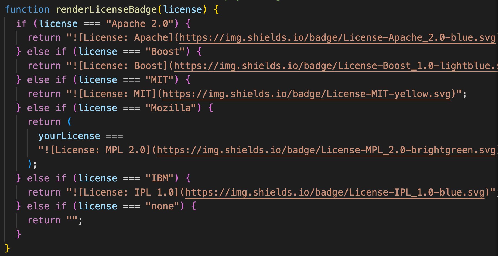

# README Generator
## License

## Description
The purpose of this project to create a command-line application that dynamically generates a professional README.md file from a user's input using the Inquirer package.`fs` for writing to the file system and`inquirer`package for collecting user input.
The application will be invoked by using the following command `node index.js`.
## Table of Contents
- [Installation](#installation)
- [Usage](#usage)
- [Contributing](#contributing)
- [License](#license)
- [Tests](#tests)
- [Questions](#questions)
## Installation
* Install Node in your computer by going to `https://nodejs.org/en/download/`
* Create a new github repository and clone it to your local machine.
* Navigate to the repo which you just created by typing`cd` command  and open it in your code editor by typing the command in your terminal `code .`
* Open the terminal in your code editor,initialized the repository with a `package.json` file by running `npm init -y`.
* Install the `Inquirer package`by typing the command `npm install inquirer` which will collect the user input.
* Application will be invoked by using the following command:
```bash
node index.js
```
## Usage
# Code Examples and Screenshots
***Function to render the License badge***



***Function to write the user input to the README.md file***
```
function writeToFile(fileName, data) {
  // console.log(fileName);
  // console.log(data);
    fs.writeFile(fileName, generateReadMe(data),'utf-8',(err) =>{
        if (err)
        console.log(err);
        else {
            console.log('"Success! Your README.md file has been generated"')
        }
    })
};
```

## Contributing
yes
## License
This project is license under the [License: MIT](https://opensource.org/licenses/MIT)
## Tests
test.js
## Technologies Used


## Questions
Github Repo URL: [Github](https://github.com/ashachakre0906)<br>
Email Address: chourpagar.asha@gmail.com
